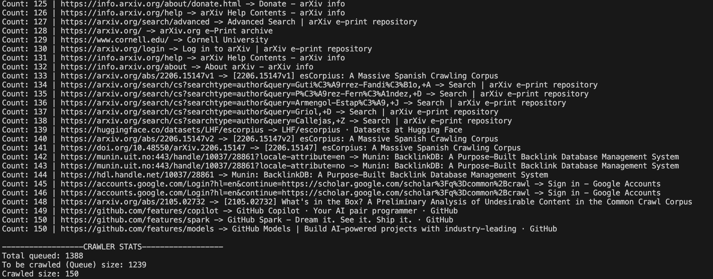
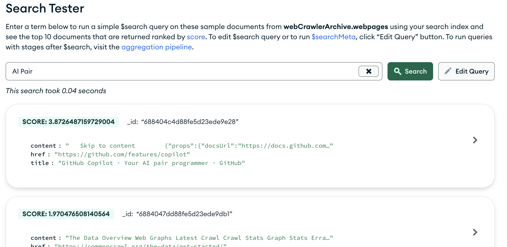

# Web Crawler with Searchable Archive

A lightweight, configurable web crawler written in Go that builds a searchable archive of crawled web pages using MongoDB Atlas Search.

## Features

- **Customizable Crawling**: Specify a seed URL and maximum crawl limit via command-line flags
- **Searchable Web Archive**: Stores crawled pages in MongoDB with:
  - URL
  - Page title
  - First 500 characters of content (after `<body>` tag)
- **Full-Text Search**: MongoDB Atlas Search index on title and content fields
- **Minimal Dependencies**: Uses only Go standard library (except for MongoDB driver)
- **Benchmarking**: Built-in performance measurement tools

## How It Works

The crawler implements a breadth-first search algorithm to systematically explore the web starting from your seed URL. Each page is:

1. Fetched using Go's HTTP client
2. Parsed for links (which are added to the crawl queue)
3. Processed to extract title and content
4. Stored in MongoDB with a full-text search index

The search interface leverages MongoDB's keyword analyzer to create an inverted index, enabling fast text searches across your archive.

## Future Improvements

- [ ] Implement swappable crawling algorithms (BFS/DFS/hybrid)
- [ ] Enhance content extraction (full text, metadata)
- [ ] Add more advanced search capabilities

## Why I Built This

This project began as an extension of one of the Gophercises exercises (the sitemap builder). I wanted to create a more complete web crawling solution while maintaining simplicity. By using primarily standard library components, I gained deep understanding of:

- HTML parsing
- Concurrent crawling
- Search index implementation
- Performance benchmarking

The only external service used is MongoDB Atlas for its search capabilities.
